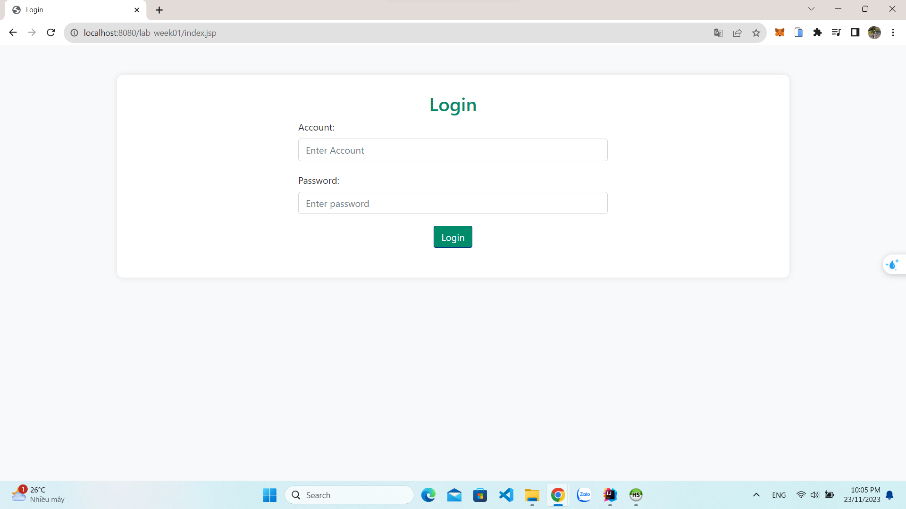

# www-lab-week01
# Quản Lý Đăng Nhập

- Thông tin bao gồm: account đăng nhập, ngày giờ
đăng nhập, ngày giờ đăng xuất, ghi chú.

- Sử dụng: Servlet Jakarta EE, JSP, CRUD JPA.
  
- Mô tả
  
 > Một trang html hiển thị cửa sổ đăng nhập. Nếu đăng nhập thành công và là quyền admin 
thì hiển thị trang dashboard cho phép quản lý các account khác (bao gồm các quyền thêm, 
xóa, sửa và cấp quyền). Còn không (không phải admin) thì hiển thị thông tin của người 
đăng nhập.
 >
 > Ghi log mỗi lần account đăng nhập, đăng xuất.
> 
-  Entity Relationship Diagram:

  

  -  Class Diagram:

- Trang login
  
- Trang view account
  
    
